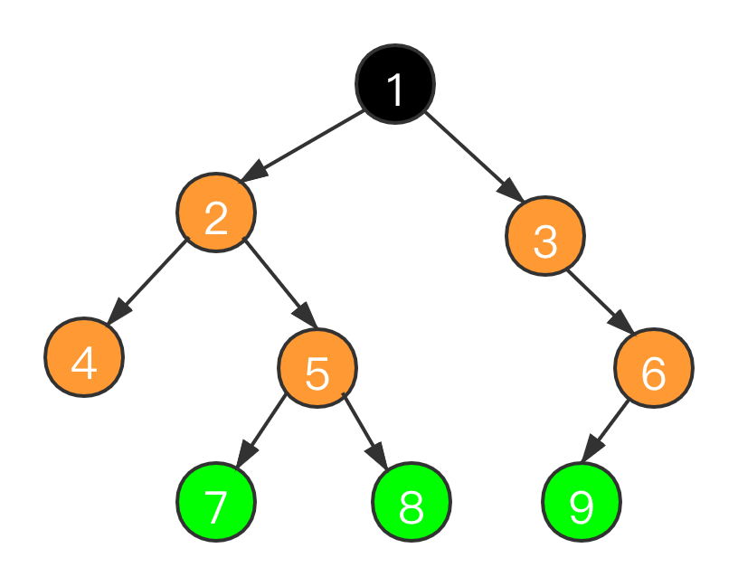

# 数据结构

## 数组

### 特点

* 相同类型的数据元素
* 连续的内存空间

### 操作时间复杂度

| 操作    | 时间复杂度 |
| ------- | ---------- |
| prepend | O(n)       |
| append  | O(1)       |
| lookup  | O(1)       |
| insert  | O(n)       |
| Delete  | O(n)       |

## 链表

### 特点

* 相同类型的数据元素
* 可以是不连续的内存空间

### 操作时间复杂度

| 操作    | 时间复杂度 |
| ------- | ---------- |
| prepend | O(1)       |
| append  | O(1)       |
| Lookup  | O(n)       |
| insert  | O(1)       |
| delete  | O(1)       |

## 跳表

## 栈

## 队列

## 树

 

```java
public static class TreeNode {
  int val;
  TreeNode left;
  TreeNode right;
  TreeNode(int x) { val = x; }
}
```

* 黑色的是根节点,根节点没有父节点,可以有n(n>=0)个子节点
* 绿色的是叶子结点,叶子结点只有一个父节点,没有子节点
* 其余的为分支节点,有一个父节点和n(n>=1)个子节点
* 不存在环

### 树的遍历

#### 前序遍历

前序遍历是的顺序是: **根--->左--->右**,所以结果就是:124578369

* 递归实现

```java
public static void preorder_r(TreeNode root) {
  if (root == null) {
    return;
  }
  System.out.print(root.val);
  preorder_r(root.left);

  preorder_r(root.right);
}
```

* 迭代实现

```java
public static void preorder_iterate(TreeNode root) {
  if (root == null) {
    return;
  }
  Stack<TreeNode> stack = new Stack<>();
  stack.push(root);
  while (!stack.isEmpty()) {
    TreeNode tmp = stack.pop();
    System.out.print(tmp.val);
    if (tmp.right != null) {
      stack.push(tmp.right);
    }

    if (tmp.left != null) {
      stack.push(tmp.left);
    }
  }
}
```


#### 中序遍历

中序遍历是的顺序是: **左--->根--->右**,所以结果就是:427581396

* 递归

```java
public static void inorder_r(TreeNode root) {
  if (root == null) {
    return;
  }
  inorder_r(root.left);
  System.out.print(root.val);
  inorder_r(root.right);
}
```

* 迭代

```java
public static void inorder_iterate(TreeNode root) {
  if (root == null) {
    return;
  }
  Stack<TreeNode> stack = new Stack<>();
  while (!stack.isEmpty() || root != null) {
    while (root != null) {
      stack.push(root);
      root = root.left;
    }
    TreeNode subRoot = stack.pop();
    System.out.print(subRoot.val);
    root = subRoot.right;
  }
}
```

#### 后序遍历

后序遍历是的顺序是: **左--->右--->根**,所以结果就是:478529631

* 递归

```java
public static void postorder_r(TreeNode root) {
  if (root == null) {
    return;
  }
  postorder_r(root.left);
  postorder_r(root.right);
  System.out.print(root.val);
}
```


* 迭代

```java
public static void postorder_iterate(TreeNode root) {
  Map<TreeNode, Boolean> visited = new HashMap<>();
  if (root == null) {
    return;
  }
  Stack<TreeNode> stack = new Stack<>();
  while (!stack.isEmpty() || root != null) {
    while (root != null) {
      stack.push(root);
      root = root.left;
    }

    TreeNode subRoot = stack.peek();
    if (subRoot.right == null || visited.get(subRoot.right) != null) {
      stack.pop();
      System.out.print(subRoot.val);
      visited.put(subRoot, true);
    } else {
      root = subRoot.right;
    }
  }
}
```

#### 层次遍历

后序遍历是的顺序是: **从左到右,从上到下**,所以结果就是:123456789

```java
public static void bfs(TreeNode root) {
  if (root == null) {
    return;
  }
  Queue<TreeNode> queue = new LinkedList<>();
  queue.add(root);
  while (!queue.isEmpty()) {
    TreeNode tmp = queue.poll();
    System.out.print(tmp.val);
    if (tmp.left != null) {
      queue.add(tmp.left);
    }
    if (tmp.right != null) {
      queue.add(tmp.right);
    }
  }
}
```