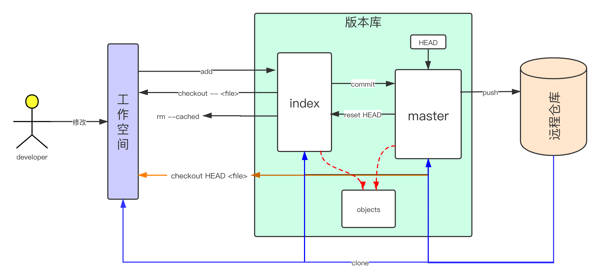

# [Git](https://git-scm.com/docs)

## 基本概念

* **工作区:**  开发者实际操作的目录
* **暂存区:**  stage/index,存放在工作区.git目录下的index文件中
* **版本库:**  .git目录
* **远程仓库:**  托管在因特网或其他网络中的你的项目的版本库

## 工作区、暂存区、版本库和远程仓库之间的关系

## git 操作

### git add

在工作空间中找到当前的内容以更新索引，为下一次提交准备暂存的内容.默认不会添加被忽略的文件

## git commit

* 创建一个新的提交，其中包含索引的当前内容以及描述更改的给定日志消息
* 保存提交的历史记录

## git reset

暂存区的内容被master替换