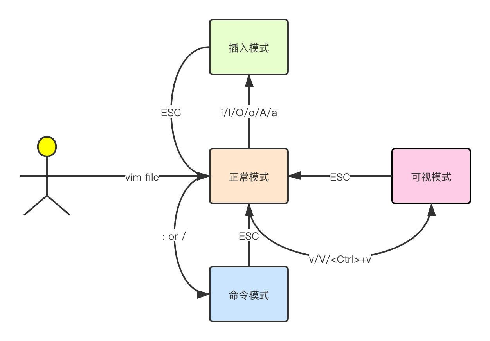

# VIM

## 四种模式

* **正常模式:**  在正常模式下,你可以输入所有正常编辑命令
* **可视模式:**  类似于正常模式,但是移动命令会突出显示选中区域
* **插入模式:**  你输入的文本会被插入到缓冲
* **命令模式:**  可以在页面底部输入文本

## 正常模式

### 跳到行尾

在正常模式下输入$(Shift+4)

### 跳到行首

正常模式下输入0

### 跳到下一行行首

正常模式下输入o

## 插入模式

## 命令模式

## 可视模式